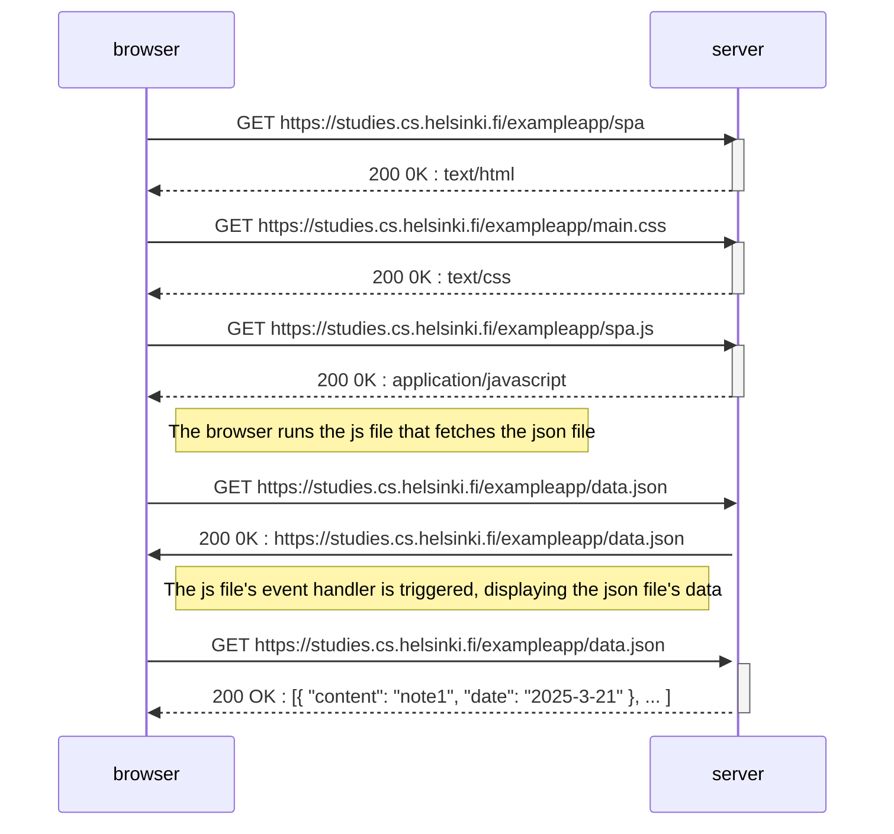

```mermaid
sequenceDiagram
    participant browser
    participant server

    browser->>server: GET https://studies.cs.helsinki.fi/exampleapp/spa
    activate server
    server-->>browser: 200 0K : text/html
    deactivate server

    browser->>server: GET https://studies.cs.helsinki.fi/exampleapp/main.css
    activate server
    server-->>browser: 200 0K : text/css
    deactivate server

    browser->>server: GET https://studies.cs.helsinki.fi/exampleapp/spa.js
    activate server
    server-->>browser: 200 0K : application/javascript
    deactivate server

    Note right of browser: The browser runs the js file that fetches the json file

    browser->>server: GET     https://studies.cs.helsinki.fi/exampleapp/data.json
    activate server
    server->>browser: 200 0K :     https://studies.cs.helsinki.fi/exampleapp/data.json

    Note right of browser: The js file's event handler is triggered, displaying the json file's data

    browser->>server: GET https://studies.cs.helsinki.fi/exampleapp/data.json
    activate server
    server-->>browser: 200 OK : [{ "content": "note1", "date": "2025-3-21" }, ... ]
    deactivate server


```